:toc: left
:toclevels: 5
:sectnums:
:stem:
:source-highlighter: coderay

= 花束問題のケーススタディ

== 背景

=== ドメイン

=== 組織図

=== SWOT分析

=== ビジネスモデル

== 要件

要件定義にはリレーションシップ駆動要件分析(RDRA)を使用する。

RDRAとは短時間で要件を把握することを目的とした軽量の手法。 RDRAでは、決められたアイコンを使い、アイコンとアイコン、アイコンと図を関連づけ、アイコンで表現されたモデル要素と関連のつながりから要件を説明する。

____
image::images/rdra.png[]

____

https://www.amazon.co.jp/RDRA2-0-%E3%83%8F%E3%83%B3%E3%83%89%E3%83%96%E3%83%83%E3%82%AF-%E8%BB%BD%E3%81%8F%E6%9F%94%E8%BB%9F%E3%81%A7%E7%B2%BE%E5%BA%A6%E3%81%AE%E9%AB%98%E3%81%84%E8%A6%81%E4%BB%B6%E5%AE%9A%E7%BE%A9%E3%81%AE%E3%83%A2%E3%83%87%E3%83%AA%E3%83%B3%E3%82%B0%E6%89%8B%E6%B3%95-%E7%A5%9E%E5%B4%8E%E5%96%84%E5%8F%B8-ebook/dp/B07STQZFBX[RDRA2.0 ハンドブックより引用]

また、要件定義は開発と並行して都度反映され運用にも影響を与える。

=== システム価値

==== システムコンテキスト

==== 要求モデル

=== システム外部環境

==== ビジネスコンテキスト

==== ビジネスユースケース

==== 業務フロー

==== 利用シーン

==== バリエーション・条件

=== システム境界

==== ユースケース複合図

=== システム

==== 情報モデル

==== 状態モデル

== 開発

=== 仕様

==== コンテキストマップ

[plantuml]
----
skinparam componentStyle uml2

component [AuthContext] <<認証・認可>>

----

==== ユースケース

image:images/jig/service-method-call-hierarchy.svg[]

=== 設計

==== アプリケーションアーキテクチャ

image::images/jig/architecture.svg[]

==== ドメインモデル

image::images/jig/business-rule-relation.svg[]

==== データモデル

image::images/schemaspy/tables/usr.1degree.png[]

== 運用

=== 開発

=== テスト

=== ビルド

=== デプロイ

== 構築

[cols="1,1,1"]
|===
|ソフトウェア |バージョン |備考
|Java
|17
|
|Node.js
|16.3.0
|
|===

=== アプリケーションコンポーネント

==== プロダクション・開発環境

[plantuml]
----
package "UI" {
  [React]
}

package "API" {
  [SpringBoot]
}

database "DB" {
  frame "H2" {
    [test]
  }

  frame "PostgreSQL" {
    [development]
    [production]
  }
}

[React] -> [SpringBoot]
[SpringBoot] -- [test]
[SpringBoot] -- [development]
[SpringBoot] -- [production]
----

=== コンポーネントセットアップ

==== 開発関連

===== 開発ツール

[source,bash]
----
npm init -y
npm install --save-dev @babel/core @babel/cli @babel/preset-env @babel/register
npm install --save-dev npm-run-all watch foreman cpx rimraf marked@1.2.2
npm install --save-dev webpack webpack-cli html-webpack-plugin webpack-dev-server
touch Procfile.dev
----

==== ドキュメント関連

===== Asciidoctor

[source,bash]
----
npm install --save-dev asciidoctor asciidoctor-kroki
----

==== フロントエンド関連

===== Cypress

[source,bash]
----
npm install cypress
npmx cypress open
npm install --save-dev cypress-cucumber-preprocessor
npm install --save-dev cucumber-html-reporter
----

===== React

[source,bash]
----
npm install --save-dev jest
npm install react react-dom
npm install --save-dev babel-loader @babel/preset-react
npm install --save-dev @testing-library/react @testing-library/jest-dom
npm install --save-dev sass-loader sass style-loader css-loader
npm install --save-dev identity-obj-proxy
npm install react-router-dom
npm install --save-dev typescript ts-loader
npm install --save @types/react @types/react-dom @types/react-router-dom
npm install --save-dev @types/jest@27.4.1 ts-jest@27.1.4
npx tsc --init
npm install -save @reduxjs/toolkit react-redux
npm install -save axios @types/axios
npm install --save-dev react-hook-form
npm install cross-env
----

== 配置

=== システムアーキテクチャ

[plantuml]
----
@startuml
actor 開発者
actor 利用者

cloud "Vercel" as vercel {
    package "Production Environment" as ui_prd_env {
      [UI] as ui_prd
    }
}

cloud "Heroku" as heroku {
    package "Production Environment" as api_prd_env {
      [API] as api_prd
      [DB] as db_prd
    }
}

cloud "GitHub" as github {
  [Git] as repository
}

開発者 --> repository
repository --> heroku
repository --> vercel
api_prd -> db_prd
api_prd <-- ui_prd
ui_prd <-- 利用者
@enduml
----

=== CIセットアップ

[source,bash]
----
git update-index --chmod=+x gradlew
----

=== Herokuセットアップ

[source,bash]
----
heroku create ape2022-take15
----

== 参照

- https://www.benkyoenkai.org/contents/Bouquet1-2[花束問題V1.2]
