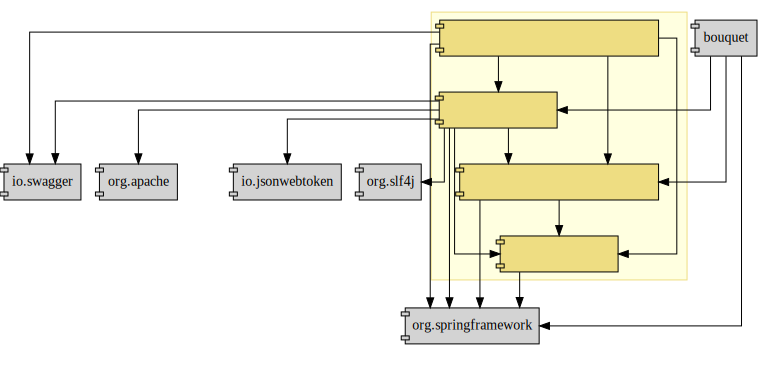

:toc: left
:toclevels: 5
:sectnums:
:stem:
:source-highlighter: coderay

= 花束問題のケーススタディ

== 背景

=== ドメイン

[quote,花束問題V1.2 事業と問題の概要]
____
フラワーショップ「フレール・メモワール」は店舗売りとは切り離してWEBショップ事業を立ち上げた。WEBで注文を受け付けて、指定された日付に指定場所に花束を届けるという形態。

当初は受注も少なく手作業で管理出来ていたが、受注が増えるにつれシステム化の必要性が出てきた。「新鮮な花を大切な記念日に」を売り文句にしていることもあって、廃棄される在庫が多く、受注の増加にともなって利益が伸びていないため。
____

=== 組織図

=== SWOT分析

=== ビジネスモデル

== 要件

要件定義にはリレーションシップ駆動要件分析(RDRA)を使用する。

RDRAとは短時間で要件を把握することを目的とした軽量の手法。 RDRAでは、決められたアイコンを使い、アイコンとアイコン、アイコンと図を関連づけ、アイコンで表現されたモデル要素と関連のつながりから要件を説明する。

____
image::images/rdra.png[]
image::images/rdra2.png[]
____

https://www.amazon.co.jp/RDRA2-0-%E3%83%8F%E3%83%B3%E3%83%89%E3%83%96%E3%83%83%E3%82%AF-%E8%BB%BD%E3%81%8F%E6%9F%94%E8%BB%9F%E3%81%A7%E7%B2%BE%E5%BA%A6%E3%81%AE%E9%AB%98%E3%81%84%E8%A6%81%E4%BB%B6%E5%AE%9A%E7%BE%A9%E3%81%AE%E3%83%A2%E3%83%87%E3%83%AA%E3%83%B3%E3%82%B0%E6%89%8B%E6%B3%95-%E7%A5%9E%E5%B4%8E%E5%96%84%E5%8F%B8-ebook/dp/B07STQZFBX[RDRA2.0 ハンドブックより引用]

また、要件定義は開発と並行して都度反映され運用にも影響を与える。

image::images/life_cycle.drawio.svg[]

=== システム価値

==== システムコンテキスト

[plantuml]
----
@startuml

title システムコンテキスト図

left to right direction

actor ユーザー as ac_01
actor スタッフ as ac_02
actor 得意先 as ac_03
ac_01 <|-- ac_02
ac_01 <|-- ac_03
actor 個人 as ac_04
ac_03 <|- ac_04

note top of ac_01
  ユーザーとはシステムを利用するアクター全般を指す。
  お金を払って製品を購入する得意先。
  販売管理業務を担当するスタッフ。
end note

usecase 販売管理システム as uc_01
note top of uc_01
  得意先の受注を管理できるようにする。
  商品の受発注を管理できるようにする。
  商品の在庫を管理できるようにする。
end note

usecase 販売サイト as uc_02
note top of uc_02
  得意先がオンラインで商品を注文できるようにする。
end note

ac_02 -- (uc_01)
ac_03 -- (uc_02)

@enduml
----

==== 要求モデル

===== 得意先

[plantuml]
----
@startuml

title 要求モデル図

left to right direction

actor 得意先 as ac_01
note "オンラインで商品を閲覧したい" as k_r1
note "オンラインで商品を購入したい" as k_r2
note as k_dr1 #Turquoise
 ＩＤの登録の際にクレジットカード情報を入れるため請求や入金に関しては考慮する必要はない
end note

ac_01 -- k_r1
ac_01 -- k_r2
k_r2 -- k_dr1

@enduml
----

===== スタッフ

[plantuml]
----
@startuml

title 要求モデル図

left to right direction

actor スタッフ as ac_02
note "商品と在庫を管理したい" as k_r3
note "得意先と受注・出荷を管理したい" as k_r4
note "発注と入荷を管理したい" as k_r5
note as k_dr2 #Turquoise
 花束の組み合わせは事前に「商品」として決めうちされている。
 １個の商品あたり、どの「単品（後述）」がどれだけ必要かも決められている。
 シングルレベルしかない部品表のようなもの。
 単品の在庫も含めて、保管場所は１箇所で、これが増える予定もない。
end note
note as k_dr3 #Turquoise
 花束の材料となるそれぞれの花は「単品」として管理される。
 「単品」はそれぞれ特定の仕入先から購入され、単品毎に品質維持可能日数が決められている。
 購入後にその日数を超えると結束には利用できずに廃棄されなければならない。
 なお、受注・出荷されるものは「商品」のみであって、単品がそのまま出荷されることはない。
end note
note as k_dr4 #Turquoise
 リピータを期待するので、得意先（個人のみ）情報を管理したい。
 届け先は毎回違う可能性があるが、前回の受注情報から届け先を簡単にコピーできるような機能は欲しい。
end note
note as k_dr5 #Turquoise
 １回の受注で、１箇所の届け先に対する１種類の商品１個を、「届け日」と「お届けメッセージ」、「お届け先電話番号」とともに受け付ける。
  出荷日は届け先に関係なく届け日の前日とする。
end note
note as k_dr6 #Turquoise
 いったん受注を受けてから、届け日の変更が要望されることがある。
 その際には可能な限り変更に対応できるようにしたいが、指定日に出荷変更できないようならばその旨を得意先に直ちに伝えられるようでなければならない。
end note
note as k_dr7 #Turquoise
 単品を結束して商品（花束）にするための工程は十分に効率化されていて、材料さえあれば一瞬で結束可能とみなしてよい。
 したがって、出荷日当日に結束指示すれば出荷可能である。
end note
note as k_dr8 #Turquoise
 単品を発注する際、単品毎に発注リードタイム（入荷されるまでにかかる日数）が異なる。
 発注リードタイムさえ越えていれば、どんな将来の入荷向けの単品も発注可能だし、入荷日の変更要望も受け付けてもらえる。
end note
note as k_dr9 #Turquoise
 「単品」毎に購入単位数が決まっている。たとえば、５０本必要だとしても、購入単位が１００本ならば１００本買わなければならない。
 なお、仕入先の供給能力は十分かつ、納期も正確とみなしてよい。
end note
note as k_dr10 #Turquoise
 発注の判断は、在庫推移（日別の在庫予定数）をみながら人間が行う。
 したがって、自動発注処理を考える必要はない。
end note

ac_02 -- k_r3
ac_02 -- k_r4
ac_02 -- k_r5
k_r3 -- k_dr2
k_r3 -- k_dr3
k_r4 -- k_dr4
k_r4 -- k_dr5
k_r4 -- k_dr6
k_r4 -- k_dr7
k_r5 -- k_dr8
k_r5 -- k_dr9
k_r5 -- k_dr10

@enduml
----

=== システム外部環境

==== ビジネスコンテキスト

[plantuml]
----
@startuml

title ビジネスコンテキスト図

left to right direction

actor 得意先 as ac_01

node WEB店舗 as no_01{
  usecase ユーザー管理 as uc_03
  usecase 受注管理 as uc_01
}

node 店舗 as no_02 {
  actor スタッフ as ac_02

  usecase 在庫管理 as uc_02
  usecase 取引先管理 as uc_04
  artifact 商品 as ar_01
  artifact 単品 as ar_02
}

node 仕入先 as no_03 {
}

node 得意先 as no_04 {
}

ac_01 -- (uc_01)
ac_02 - (uc_01)
(uc_01) -- (ar_01)
(uc_01) -- (ar_02)
ac_02 -- (uc_02)
(uc_02) -- (ar_01)
(uc_02) -- (ar_02)
(uc_02) -- no_03
ac_01 -- (uc_03)
ac_02 -- (uc_03)
ac_02 -- (uc_04)
no_03 -- (uc_04)
no_04 -- (uc_04)

@enduml
----

==== ビジネスユースケース

===== ユーザー管理

[plantuml]
----
@startuml

title ビジネスユースケース図 - ユーザー管理

left to right direction

actor 得意先 as ac_01
actor スタッフ as ac_02

usecase ユーザー登録 as uc_01
usecase ユーザー認証 as uc_02

ac_01 -- (uc_01)
ac_01 -- (uc_02)

ac_02 -- (uc_01)
ac_02 -- (uc_02)

@enduml
----

===== 受注管理

[plantuml]
----
@startuml

title ビジネスユースケース図 - 受注管理

left to right direction

actor 得意先 as ac_01
actor スタッフ as ac_02

usecase 商品の登録 as uc_01
usecase 商品の注文 as uc_02
usecase 注文の変更 as uc_04
usecase 注文の取消 as uc_05
usecase 商品の出荷 as uc_06
usecase 商品の返品 as uc_07

ac_02 -- (uc_01)
ac_01 -- (uc_02)

ac_01 -- (uc_04)
ac_02 -- (uc_04)

ac_01 -- (uc_05)
ac_02 -- (uc_05)

ac_02 -- (uc_06)

ac_01 -- (uc_07)

@enduml
----

===== 在庫管理

[plantuml]
----
@startuml

title ビジネスユースケース図 - 在庫管理

left to right direction

actor スタッフ as ac_01
agent 仕入先 as ag_01

usecase 単品の発注 as uc_01
usecase 単品の入荷 as uc_02

ac_01 -- (uc_01)
(uc_01) -- ag_01

ac_01 -- (uc_02)
(uc_02) -- ag_01

@enduml
----

===== 取引先管理

[plantuml]
----
@startuml

title ビジネスユースケース図 - 取引先管理

left to right direction

actor スタッフ as ac_01
agent 仕入先 as ag_01
agent 得意先 as ag_02

usecase 得意先の登録 as uc_01

ac_01 -- (uc_01)
(uc_01) -- ag_01
(uc_01) -- ag_02

@enduml
----

==== 業務フロー

===== 受注管理

====== 商品の注文

[plantuml]
----
@startuml

title 業務フロー図 - 商品の注文:BUC

|得意先|
partition 注文 {
    :商品を一覧表示する;
    :選択した商品を表示する;
    :商品をカートに追加する;
    :商品を注文する;
}

|スタッフ|
partition 受注 {
    :受注内容を確認する;
    :商品を引き当る;
    if (在庫) then (有り)
     :出荷予定日を確認する;
    else (無し)
     partition 発注 {
         :単品を発注する;
         |仕入先|
         :納品予定を通知する;
         |スタッフ|
         :リードタイムを確認する;
         :出荷予定日を確認する;
     }
    endif
    :注文承諾を通知する;
}

end

@enduml
----

====== 注文の変更

[plantuml]
----
@startuml

title 業務フロー図 - 注文の変更:BUC

|得意先|
partition 注文 {
:注文を変更する;
}
partition 受注 {
    |スタッフ|
    :変更内容を確認する;
    if (変更) then (可能)
     |スタッフ|
     :商品を引き当てる;
     if (在庫) then (有り)
      :出荷予定を確認する;
     else (無し)
      partition 発注 {
          :単品を発注する;
          |仕入先|
          :納品予定を通知する;
          |スタッフ|
          :リードタイムを確認する;
      }
     endif
    else (不可能)
     :変更できないこと通知する;
     end
    endif
    :注文内容変更を通知する;
}
end

@enduml
----

====== 注文の取消

[plantuml]
----
@startuml

title 業務フロー図 - 注文の取消:BUC

|得意先|
partition 注文 {
:注文を取消する;
}
partition 受注 {
    |スタッフ|
    :取消注文を確認する;
    if (出荷) then (未)
     |スタッフ|
     :受注を取消す;
     if (発注) then (未)
        :取消注文を通知する;
     else (済)
        :発注を取消す;
        if (取消) then (OK)
            :取消注文を通知する;
        else (NG)
            :取消できないことを通知する;
            end
        endif
     endif
    else (済)
     |スタッフ|
     :取消できないことを通知をする;
     end
    endif
}
end

@enduml
----

====== 商品の出荷

[plantuml]
----
@startuml

title 業務フロー図 - 商品の出荷:BUC

|スタッフ|
partition 出庫 {
    :単品をピッキングする;
}
partition 出荷 {
    :単品を結束して商品にする;
    :商品を出荷する;
    :出荷案内を通知する;
}
partition 注文 {
|得意先|
:商品を受け取る;
}

end

@enduml
----

====== 商品の返品

[plantuml]
----
@startuml

title 業務フロー図 - 商品の返品:BUC

|得意先|
partition 注文 {
:商品を返品する;
}

partition 返品 {
    |スタッフ|
    :商品を受け取る;
    :返品処理をする;
    :商品を廃棄する;
}
end

@enduml
----

===== 在庫管理

====== 単品の発注

[plantuml]
----
@startuml

title 業務フロー図 - 単品の発注:BUC

|スタッフ|
partition 発注 {
:在庫推移を確認する;
if (発注) then (不要)
 end
else (必要)
 :単品を発注する;
 |仕入先|
 :納品予定を通知する;
 |スタッフ|
 :リードタイムを確認する;
endif
}

end

@enduml
----

====== 単品の入荷

[plantuml]
----
@startuml

title 業務フロー図 - 単品の入荷:BUC
|仕入先|
:単品を出荷する;
|スタッフ|
partition 検収 {
    :単品を検収する;
    if (検収) then (NG)
     partition 返品 {
         :単品を返品する;
         |仕入先|
         :代替品納品予定を通知する;
         |スタッフ|
         :リードタイムを確認する;
         :出荷予定を通知する;
     }
     end
    else (OK)
     |スタッフ|
     partition 入庫 {
     :単品を入庫する;
     }
     end
    endif
}

@enduml
----

==== 利用シーン

===== ユーザー管理

====== ユーザー認証

[plantuml]
----
@startuml

title 利用シーン図 - ユーザー認証:BUC

left to right direction

actor 得意先 as ac_01
actor スタッフ as ac_02

frame 認証 as fr_01
note right of fr_01
  登録済みのユーザーを認証してシステムの利用を認証・認可する
end note

usecase ユーザーを認証する as uc_01

:ac_01: -- fr_01
:ac_02: -- fr_01
fr_01 -- (uc_01)

@enduml
----

====== ユーザー登録

[plantuml]
----
@startuml

title 利用シーン図 - ユーザー登録:BUC

left to right direction

actor 得意先 as ac_01
actor スタッフ as ac_02

frame ユーザー as fr_01
note right of fr_01
  システムを利用できるユーザーを登録する
end note

usecase ユーザーを登録する as uc_01
usecase ユーザーを確認する as uc_02
usecase ユーザー情報を更新する as uc_03
usecase ユーザー登録を解除する as uc_04
usecase ユーザー登録を復活する as uc_05
usecase ユーザー登録を抹消する as uc_06

:ac_01: -- fr_01
:ac_02: -- fr_01
fr_01 -- (uc_01)
fr_01 -- (uc_02)
fr_01 -- (uc_03)
fr_01 -- (uc_04)
fr_01 -- (uc_05)
fr_01 -- (uc_06)

@enduml
----

===== 受注管理

====== 商品の登録

[plantuml]
----
@startuml

title 利用シーン図 - 商品の登録:BUC

left to right direction

actor スタッフ as ac_01

frame 商品 as fr_01
note right of fr_01
  商品を登録する
end note

frame 販売 as fr_02
note right of fr_02
  登録した商品を販売する
end note

usecase 商品を登録する as uc_01
usecase 商品を確認する as uc_02
usecase 商品情報を更新する as uc_03
usecase 販売を停止する as uc_04
usecase 販売を再開する as uc_05
usecase 販売を終了する as uc_06

:ac_01: -- fr_01
:ac_01: -- fr_02
fr_01 -- (uc_01)
fr_01 -- (uc_02)
fr_01 -- (uc_03)
fr_02 -- (uc_04)
fr_02 -- (uc_05)
fr_02 -- (uc_06)

@enduml
----

===== 取引先管理

====== 取引先の登録

[plantuml]
----
@startuml

title 利用シーン図 - 取引先の登録:BUC

left to right direction

actor スタッフ as ac_01

frame 受注 as fr_01
note right of fr_01
  対象は顧客である得意先。
end note

frame 発注 as fr_02
note right of fr_02
  対象は単品の仕入先。
end note

usecase 得意先を登録する as uc_01
usecase 得意先を確認する as uc_02
usecase 得意先情報を更新する as uc_03
usecase 仕入先を登録する as uc_04
usecase 仕入先を確認する as uc_05
usecase 仕入先情報を更新する as uc_06
usecase 取引を停止する as uc_07
usecase 取引を再開する as uc_08
usecase 取引を終了する as uc_09

:ac_01: -- fr_01
:ac_01: -- fr_02
fr_01 -- (uc_01)
fr_01 -- (uc_02)
fr_01 -- (uc_03)
fr_01 -- (uc_07)
fr_01 -- (uc_08)
fr_01 -- (uc_09)
fr_02 -- (uc_04)
fr_02 -- (uc_05)
fr_02 -- (uc_06)
fr_02 -- (uc_07)
fr_02 -- (uc_08)
fr_02 -- (uc_09)

@enduml
----
==== バリエーション・条件

|===
|ユーザー区分

|得意先
|スタッフ

|===

=== システム境界

==== ユースケース複合図

===== ユーザー管理

====== ユーザー認証

[plantuml]
----
@startuml
actor "得意先" as ac_01
actor "スタッフ" as ac_02
frame "認証" as f01
usecase "ユーザーを認証する" as UC1
boundary "ログイン画面" as b01
entity "ユーザー" as e01
ac_01 - f01
ac_02 -- f01
f01 - UC1
b01 -- UC1
UC1 - e01
@enduml
----

====== ユーザー登録

[plantuml]
----
@startuml
actor "スタッフ" as ac_01
frame "ユーザー" as f01
usecase "ユーザーを確認する" as UC1
usecase "ユーザーを登録する" as UC2
usecase "ユーザー情報を更新する" as UC3
usecase "ユーザー登録を抹消する" as UC4
boundary "ユーザー一覧画面" as b01
boundary "ユーザー画面" as b02
entity "ユーザー" as e01
control "ユーザーバリエーション" as c01

ac_01 - f01
f01 - UC1
f01 - UC2
f01 - UC3
f01 - UC4
b01 -- UC1
b02 -- UC2
b02 -- UC3
b02 -- UC4
UC2 -- c01
UC3 -- c01
UC4 -- c01
UC1 - e01
UC2 - e01
UC3 - e01
UC4 - e01
@enduml
----

[plantuml]
----
@startuml
actor "得意先" as ac_01
frame "ユーザー" as f01
usecase "ユーザーを確認する" as UC1
usecase "ユーザーを登録する" as UC2
usecase "ユーザー情報を更新する" as UC3
boundary "ユーザー画面" as b02
entity "ユーザー" as e01
control "ユーザーバリエーション" as c01

ac_01 - f01
f01 - UC1
f01 - UC2
f01 - UC3
b02 -- UC1
b02 -- UC2
b02 -- UC3
UC2 -- c01
UC3 -- c01
UC1 - e01
UC2 - e01
UC3 - e01
@enduml
----

===== 受注管理

====== 商品の登録

[plantuml]
----
@startuml
actor "スタッフ" as ac_01
frame "商品" as f01
usecase "商品を登録する" as UC1
usecase "商品を確認する" as UC2
usecase "商品情報を更新する" as UC3
boundary "商品登録画面" as b01
entity "商品" as e01
control "商品バリエーション" as c01

ac_01 - f01
f01 - UC1
f01 - UC2
f01 - UC3
b01 -- UC1
b01 -- UC2
b01 -- UC3
UC1 - e01
UC2 - e01
UC3 - e01
UC1 -- c01
UC2 -- c01
UC3 -- c01
@enduml
----

[plantuml]
----
@startuml
actor "スタッフ" as ac_01
frame "販売" as f01
usecase "販売を停止する" as UC1
usecase "販売を再開する" as UC2
usecase "販売を終了する" as UC3
boundary "商品登録画面" as b01
entity "商品" as e01
control "販売バリエーション" as c01

ac_01 - f01
f01 - UC1
f01 - UC2
f01 - UC3
b01 --- UC1
b01 --- UC2
b01 --- UC3
UC1 - e01
UC2 - e01
UC3 - e01
UC1 -- c01
UC2 -- c01
UC3 -- c01
@enduml
----

====== 商品の注文

[plantuml]
----
@startuml
actor "得意先" as ac_01
frame "注文" as f01
usecase "商品を一覧表示する" as UC1
usecase "選択した商品を表示する" as UC2
usecase "商品をカートに追加する" as UC3
usecase "商品を注文する" as UC4
usecase "商品をカートから削除する" as UC5
boundary "商品一覧画面" as b01
boundary "商品明細画面" as b02
boundary "商品カート画面" as b03
entity "商品" as e01
entity "在庫" as e02
control "商品バリエーション" as c01
control "注文バリエーション" as c02

ac_01 - f01
f01 - UC1
f01 - UC2
f01 - UC3
f01 - UC4
f01 - UC5
b01 -- UC1
b02 -- UC2
b03 -- UC3
b03 -- UC4
b03 -- UC5
UC1 - e01
UC2 - e01
UC3 - e02
UC4 - e02
UC1 -- c01
UC2 -- c01
UC3 -- c01
UC4 -- c02
UC5 -- c01
----

[plantuml]
----
@startuml
actor "スタッフ" as ac_01
frame "受注" as f01
frame "発注" as f02
usecase "受注内容を確認する" as UC1
usecase "注文を承諾する" as UC2
usecase "単品を発注する" as UC3
usecase "リードタイムを確認する" as UC4
usecase "出荷予定日を確認する" as UC5
boundary "受注一覧画面" as b01
boundary "受注明細画面" as b02
boundary "単品発注画面" as b03
entity "注文" as e01
entity "在庫" as e02
entity "単品" as e03
control "注文バリエーション" as c01
control "単品バリエーション" as c02

ac_01 - f01
ac_01 -- f02
f01 - UC1
f01 - UC2
f02 - UC3
f02 - UC4
b01 -- UC1
b02 -- UC1
b01 -- UC2
b03 -- UC3
b03 -- UC4
b01 -- UC5
UC1 - e01
UC2 - e01
UC3 - e03
UC4 - e02
UC5 - e01
UC1 -- c01
UC2 -- c01
UC3 -- c02
----

====== 注文の変更

[plantuml]
----
@startuml
actor "得意先" as ac_01
frame "注文" as f01
usecase "注文を変更する" as UC1
boundary "注文履歴画面" as b01
entity "注文" as e01
control "商品バリエーション" as c01

ac_01 - f01
f01 - UC1
b01 -- UC1
UC1 - e01
UC1 -- c01
----

[plantuml]
----
@startuml
actor "スタッフ" as ac_01
frame "受注" as f01
frame "発注" as f02
usecase "注文内容を確認する" as UC1
usecase "商品を引き当てる" as UC2
usecase "単品を発注する" as UC3
usecase "リードタイムを確認する" as UC4
boundary "注文一覧画面" as b01
boundary "注文明細画面" as b02
boundary "単品発注画面" as b03
entity "注文" as e01
entity "在庫" as e02
entity "単品" as e03
control "単品バリエーション" as c01
control "商品バリエーション" as c02

ac_01 - f01
ac_01 -- f02
f01 - UC1
f01 - UC2
f02 - UC3
f02 - UC4
b01 -- UC1
b02 -- UC2
b03 -- UC3
b03 -- UC4
UC1 - e01
UC2 - e02
UC3 - e03
UC4 - e02
UC2 -- c02
UC3 -- c01
----

====== 注文の取消

[plantuml]
----
@startuml
actor "得意先" as ac_01
frame "注文" as f01
usecase "注文を取消する" as UC1
boundary "注文履歴画面" as b01
entity "受注" as e01

ac_01 - f01
f01 - UC1
b01 -- UC1
UC1 - e01
----

[plantuml]
----
@startuml
actor "スタッフ" as ac_01
frame "受注" as f01
frame "発注" as f02
usecase "取消注文を確認する" as UC1
usecase "受注を取消す" as UC2
usecase "発注を取消す" as UC3
boundary "注文一覧画面" as b01
boundary "注文明細画面" as b02
boundary "単品発注画面" as b03
entity "受注" as e01
entity "発注" as e02

ac_01 - f01
f01 - UC1
b01 -- UC1
b02 -- UC1
b02 -- UC2
UC1 - e01
UC2 - e01
ac_01 -- f02
f02 - UC3
b03 -- UC3
UC3 - e02
----

====== 商品の出荷

[plantuml]
----
@startuml
actor "スタッフ" as ac_01
frame "出庫" as f01
frame "出荷" as f02
usecase "単品をピッキングする" as UC1
usecase "単品を結束して商品にする" as UC2
usecase "商品を出荷する" as UC3
boundary "出荷一覧画面" as b01
boundary "出荷明細画面" as b02
entity "在庫" as e01
entity "商品" as e02
entity "注文" as e03
entity "売上" as e04
control "商品バリエーション" as c01

ac_01 - f01
ac_01 --- f02
f01 - UC1
f02 - UC2
f02 - UC3
b01 -- UC1
b02 -- UC2
b01 -- UC3
UC1 - e01
UC1 - e03
UC2 - e01
UC3 - e01
UC3 - e02
UC3 - e04
UC2 -- c01
----

====== 商品の返品

[plantuml]
----
@startuml
actor "スタッフ" as ac_01
frame "返品" as f01
usecase "返品処理をする" as UC1
boundary "注文一覧画面" as b01
boundary "注文明細画面" as b02
entity "注文" as e01

ac_01 - f01
f01 - UC1
b01 -- UC1
b02 -- UC1
UC1 - e01
----

===== 在庫管理

====== 単品の発注

[plantuml]
----
@startuml
actor "スタッフ" as ac_01
frame "発注" as f01
usecase "在庫推移を確認する" as UC1
usecase "単品を発注する" as UC2
usecase "リードタイムを確認する" as UC3
boundary "在庫推移画面" as b01
boundary "単品発注画面" as b02
entity "在庫" as e01
entity "単品" as e02
control "単品バリエーション" as c01

ac_01 - f01
f01 - UC1
f01 - UC2
f01 - UC3
b01 -- UC1
b02 -- UC2
b02 -- UC3
UC1 - e01
UC2 - e02
UC3 - e01
UC2 -- c01
----

====== 単品の入荷

[plantuml]
----
@startuml
actor "スタッフ" as ac_01
frame "検収" as f01
frame "入庫" as f02
frame "返品" as f03
usecase "単品を検収する" as UC1
usecase "単品を入庫する" as UC2
usecase "単品を返品する" as UC3
usecase "リードタイムを確認する" as UC4
boundary "単品発注画面" as b01
boundary "在庫推移画面" as b02
entity "在庫" as e01
entity "単品" as e02
entity "仕入" as e03

ac_01 - f01
ac_01 -- f02
ac_01 ---- f03
f01 - UC1
f02 - UC2
f03 - UC3
f03 - UC4
b01 -- UC1
b01 -- UC2
b01 -- UC3
b02 -- UC4
UC1 - e01
UC2 - e02
UC2 - e03
UC4 - e01
----

===== 取引先管理

====== 取引先の登録

[plantuml]
----
@startuml
actor "スタッフ" as ac_01
frame "受注" as f01
usecase "得意先を登録する" as UC1
usecase "得意先を確認する" as UC2
usecase "得意先情報を更新する" as UC3
boundary "得意先登録画面" as b01
entity "得意先" as e01
control "得意先バリエーション" as c01

ac_01 - f01
f01 - UC1
f01 - UC2
f01 - UC3
b01 -- UC1
b01 -- UC2
b01 -- UC3
UC1 - e01
UC2 - e01
UC3 - e01
UC1 -- c01
UC2 -- c01
UC3 -- c01
@enduml
----

[plantuml]
----
@startuml
actor "スタッフ" as ac_01
frame "発注" as f01
usecase "仕入先を登録する" as UC1
usecase "仕入先を確認する" as UC2
usecase "仕入先情報を更新する" as UC3
boundary "仕入先登録画面" as b01
entity "仕入先" as e01
control "仕入先バリエーション" as c01

ac_01 - f01
f01 - UC1
f01 - UC2
f01 - UC3
b01 -- UC1
b01 -- UC2
b01 -- UC3
UC1 - e01
UC2 - e01
UC3 - e01
UC1 -- c01
UC2 -- c01
UC3 -- c01
@enduml
----

=== システム

==== 情報モデル

[plantuml]
----
@startuml

title 情報モデル図

left to right direction

package 注文 {
entity 得意先
entity 商品
entity 受注
entity 出荷
entity 売上
}

package 在庫 {
entity 単品
entity 仕入先
entity 商品
entity 単品
entity 発注
entity 入荷
entity 在庫
entity 仕入
}

得意先 -- 受注
得意先 -- 出荷
出荷 -- 売上
受注 -- 商品
商品 -- 単品
単品 -- 在庫
仕入先 -- 発注
発注 -- 単品
仕入先 -- 入荷
入荷 -- 仕入

@enduml
----

==== 状態モデル

===== ユーザー管理

====== ユーザー認証

[plantuml]
----
@startuml

title 状態モデル図 - ユーザー認証

state 認証 {
state 未認証
state 認証済
}

[*] --> 未認証
未認証 -> 認証済 : 認証成功
未認証 -> 未認証 : 認証失敗
認証済 -> 未認証 : ログアウト
認証済 --> [*] : タイムアウト

@enduml
----

====== ユーザー登録

[plantuml]
----
@startuml

title 状態モデル図 - ユーザー登録

state ユーザー {
state 未登録
state 登録済
state 登録解除
state 抹消済
}

[*] --> 未登録
未登録 -> 登録済 : (ユーザーを登録する)
登録済 -> 登録済 : (ユーザー情報を更新する)
登録済 --> 登録解除 : (ユーザー登録を解除する)
登録解除 --> 登録済 : (ユーザー登録を復活する)
登録解除 -> 抹消済 : (ユーザー登録を抹消する)
抹消済 --> [*]

@enduml
----

===== 受注管理

====== 商品の登録

[plantuml]
----
@startuml

title 状態モデル図 - 商品の登録

state 商品 {
state 未登録
state 登録済
}

state 販売 {
state 販売中
state 販売停止
state 販売終了
}

[*] --> 未登録
未登録 -> 登録済 : (商品を登録する)
登録済 -> 登録済 : (商品情報を更新する)
登録済 --> 販売中 : (販売を開始する)
販売中 --> 販売停止 : (販売を停止する)
販売停止 --> 販売中 : (販売を再開する)
販売停止 --> 販売終了 : (販売を終了する)
販売終了 --> [*]

@enduml
----

====== 商品の注文

[plantuml]
----
@startuml

title 状態モデル図 - 商品の注文

state 注文 {
state 未注文
state カート
state 注文済
}
state 受注 {
state 引き当て待
state 引き当て済
}

[*] --> 未注文 : (商品を一覧表示する)
未注文 --> カート : (商品をカートに追加する)
カート --> 未注文 : (カートの商品を削除する)
カート --> カート : (カートの商品を変更する)
未注文 -> 注文済: (商品を注文する)

注文済 --> 引き当て待 : (注文内容を確認する)
引き当て待 --> 引き当て済 : (在庫を引き当てる)\n[在庫有り]
引き当て待 --> 引き当て待 : (在庫を引き当てる)\n[在庫無し]
引き当て済 --> [*] : (注文承諾を通知する)
----

====== 注文の変更

[plantuml]
----
@startuml

title 状態モデル図 - 注文の変更

state 注文 {
state 未変更
state 変更済
}

state 受注 {
state 未通知
state 通知済
}

[*] --> 未変更 : (注文を確認する)
未変更 --> 変更済 : (注文を変更する)
変更済 --> 未通知 : (変更内容を確認する)
未通知 -> 通知済 : (変更内容変更を通知する)
通知済 -> 変更済 : (変更内容変更を通知する)\n[未出荷]
通知済 -> 未変更 : (変更内容変更を通知する)\n[出荷済]
通知済 --> [*]

@enduml
----

====== 注文の取消

[plantuml]
----
@startuml

title 状態モデル図 - 注文の取消

state 注文 {
state 未取消
state 取消済
}

state 受注 {
state 未通知
state 通知済
}

[*] --> 未取消 : (注文を確認する)
未取消 --> 取消済 : (注文を取消する)
取消済 --> 未通知 : (取消内容を確認する)
未通知 -> 通知済 : (取消内容を通知する)
通知済 -> 取消済 : (取消内容を通知する)\n[未出荷]
通知済 -> 未取消 : (取消内容を通知する)\n[出荷済]
通知済 --> [*]

@enduml
----

====== 商品の出荷

[plantuml]
----
@startuml

title 状態モデル図 - 商品の出荷

state 出庫 {
state ピッキング待ち
state ピッキング済み
}

state 出荷 {
state 商品未出荷
state 商品出荷済み
}

[*] --> 出庫
ピッキング待ち -> ピッキング済み: (単品をピッキングする)
ピッキング済み --> 商品未出荷: (単品を結束して商品にする)
商品未出荷 -> 商品出荷済み: (商品を出荷する)
出荷 --> [*]: (出荷案内を通知する)

@enduml
----

====== 商品の返品

[plantuml]
----
@startuml

title 状態モデル図 - 商品の返品

state 注文 {
state 決済済
state 返金待
}

state 返品 {
state 返品処理待
state 返品処理中
state 返品処理済
}

[*] --> 注文
決済済 -> 返金待 : (商品を返品する)
返金待 --> 返品処理待: (返品を受け取る)
返品処理待 -> 返品処理中: (返品処理をする)
返品処理中 -> 返品処理済: (商品を廃棄する)
返品 --> [*]

@enduml
----

===== 在庫管理

====== 単品の発注

[plantuml]
----
@startuml

title 状態モデル図 - 単品の発注

state 発注 {
state 未発注
state 入荷待
state 入荷済
}

[*] --> 発注
未発注 -> 入荷待: (単品を発注する)
入荷待 -> 入荷済: (単品を入荷する)
発注 --> [*]
@enduml
----

====== 単品の入荷

[plantuml]
----
@startuml

title 状態モデル図 - 商品の入荷

state 検収 {
state 検収待
state 検収中
state 検収済
}

state 返品 {
state 返品処理待
state 返品処理中
state 返品処理済
}

state 入庫 {
state 入庫待ち
state 入庫済み
}

[*] --> 検収待: (単品を出荷する)
検収待 -> 検収中: (単品を検収する)
検収中 -> 検収済: (単品を検収する)
検収済 --> 入庫待ち: (単品を入庫する)
入庫待ち -> 入庫済み: (単品を入庫する)
入庫済み --> [*]: (単品を入庫する)

検収中 -> 返品処理待: (単品を検収する)
返品処理待-> 返品処理中: (返品処理をする)
返品処理中 -> 返品処理済: (商品を返品する)
返品処理済 -> 検収待

@enduml
----

===== 取引先管理

====== 取引先の登録

[plantuml]
----
@startuml

title 状態モデル図 - 取引先の登録

state 受注 {
state 未登録
state 登録済
state 取引中
state 取引停止
state 取引終了
}

[*] --> 未登録
未登録 -> 登録済 : (得意先を登録する)
登録済 -> 登録済 : (得意先情報を更新する)
登録済 --> 取引中 : (得意先を登録する)
取引中 --> 取引停止 : (取引を停止する)
取引停止 --> 取引中 : (取引を再開する)
取引停止 --> 取引終了 : (取引を終了する)
取引終了 --> [*]

@enduml
----

[plantuml]
----
@startuml

title 状態モデル図 - 取引先の登録

state 発注 {
state 未登録
state 登録済
state 取引中
state 取引停止
state 取引終了
}

[*] --> 未登録
未登録 -> 登録済 : (仕入先を登録する)
登録済 -> 登録済 : (仕入先情報を更新する)
登録済 --> 取引中 : (仕入先を登録する)
取引中 --> 取引停止 : (取引を停止する)
取引停止 --> 取引中 : (取引を再開する)
取引停止 --> 取引終了 : (取引を終了する)
取引終了 --> [*]

@enduml
----
== 開発

https://masuda220.hatenablog.com/entry/2020/05/27/103750[CCSR手法に準拠]

=== 仕様

==== コンテキストマップ

[plantuml]
----
skinparam componentStyle uml2

component [AuthContext] <<認証>>
component [UserContext] <<ユーザー>>
component [ProductContext] <<商品>>
component [SalesContext] <<販売>>
component [OrderContext] <<注文>>
component [ReceivedOrderContext] <<受注>>
component [PlacementOrderContext] <<発注>>
component [ShippingContext] <<出庫>>
component [DeliveryContext] <<出荷>>
component [WarehousingContext] <<入庫>>
component [ArrivedContext] <<入荷>>
component [AcceptanceContext] <<検収>>
component [ReturnedProductContext] <<返品>>
component [CustomerContext] <<得意先>>
component [SupplierContext] <<仕入先>>

[AuthContext]<-->[UserContext]
[UserContext] <-- [OrderContext]
[SalesContext] --> [ProductContext]
[ProductContext] <-- [OrderContext]
[ProductContext] <-- [ReceivedOrderContext]
[ProductContext] <-- [PlacementOrderContext]
[OrderContext] <- [ReceivedOrderContext]
[OrderContext] --> [ReturnedProductContext]
[ReceivedOrderContext] -> [PlacementOrderContext]
[ReceivedOrderContext] --> [DeliveryContext]
[DeliveryContext] --> [ShippingContext]
[PlacementOrderContext] --> [ArrivedContext]
[PlacementOrderContext] --> [ReturnedProductContext]
[ArrivedContext] <- [AcceptanceContext]
[ArrivedContext] --> [WarehousingContext]
[UserContext] <-- [CustomerContext]
[CustomerContext] <-- [ReceivedOrderContext]
[SupplierContext] <-- [PlacementOrderContext]

----

==== ユースケース

===== 認証

[plantuml]
----
@startuml
left to right direction
actor "得意先" as customer
actor "スタッフ" as staff
rectangle 認証 {
  usecase "ユーザーを認証する" as UC1
}
customer --> UC1
staff --> UC1
@enduml
----

===== ユーザー

[plantuml]
----
@startuml
left to right direction
actor "得意先" as customer
actor "スタッフ" as staff
rectangle ユーザー {
usecase "ユーザーを登録する" as UC1
usecase "ユーザーを確認する" as UC2
usecase "ユーザー情報を更新する" as UC3
usecase "ユーザー情報を解除する" as UC4
usecase "ユーザー情報を復活する" as UC5
usecase "ユーザー登録を抹消する" as UC6
}
customer --> UC1
customer --> UC2
customer --> UC3
staff --> UC1
staff --> UC2
staff --> UC3
staff --> UC4
staff --> UC5
staff --> UC6
@enduml
----

===== 商品

[plantuml]
----
@startuml
left to right direction
actor "スタッフ" as ac_01
rectangle 商品 {
usecase "商品を登録する" as UC1
usecase "商品を確認する" as UC2
usecase "商品情報を更新する" as UC3
}
ac_01 --> UC1
ac_01 --> UC2
ac_01 --> UC3
@enduml
----

===== 販売

[plantuml]
----
@startuml
left to right direction
actor "スタッフ" as ac_01
rectangle 販売 {
usecase "販売を停止する" as UC1
usecase "販売を再開する" as UC2
usecase "販売を終了する" as UC3
}
ac_01 --> UC1
ac_01 --> UC2
ac_01 --> UC3
@enduml
----

===== 注文

[plantuml]
----
@startuml
left to right direction
actor "得意先" as ac_01
rectangle 注文 {
usecase "商品を一覧表示する" as UC1
usecase "選択した商品を表示する" as UC2
usecase "商品をカートに追加する" as UC3
usecase "商品をカートから削除する" as UC4
usecase "注文を変更する" as UC5
usecase "注文を取消する" as UC6
}
ac_01 --> UC1
ac_01 --> UC2
ac_01 --> UC3
ac_01 --> UC4
ac_01 --> UC5
ac_01 --> UC6
@enduml
----

===== 受注

[plantuml]
----
@startuml
left to right direction
actor "スタッフ" as ac_01
rectangle 受注 {
usecase "受注内容を確認する" as UC1
usecase "商品を引き当てる" as UC2
usecase "受注を承諾する" as UC3
usecase "出荷予定日を確認する" as UC4
usecase "取消注文を確認する" as UC5
usecase "受注を取消す" as UC6
usecase "得意先を登録する" as UC7
usecase "得意先を確認する" as UC8
usecase "得意先情報を更新する" as UC9
}
ac_01 --> UC1
ac_01 --> UC2
ac_01 --> UC3
ac_01 --> UC4
ac_01 --> UC5
ac_01 --> UC6
ac_01 --> UC7
ac_01 --> UC8
ac_01 --> UC9
@enduml
----

===== 発注

[plantuml]
----
@startuml
left to right direction
actor "スタッフ" as ac_01
rectangle 発注 {
usecase "単品を発注する" as UC1
usecase "リードタイムを確認する" as UC2
usecase "発注を取消す" as UC3
usecase "在庫推移を確認する" as UC4
usecase "仕入先を登録する" as UC5
usecase "仕入先を確認する" as UC6
usecase "仕入先情報を更新する" as UC7
}
ac_01 --> UC1
ac_01 --> UC2
ac_01 --> UC3
ac_01 --> UC4
ac_01 --> UC5
ac_01 --> UC6
ac_01 --> UC7
@enduml
----

===== 出庫

===== 出荷

[plantuml]
----
@startuml
left to right direction
actor "スタッフ" as ac_01
rectangle 出荷 {
usecase "単品を結束して商品にする" as UC1
usecase "単品をピッキングする" as UC2
usecase "商品を出荷する" as UC3
}
ac_01 --> UC1
ac_01 --> UC2
ac_01 --> UC3
@enduml
----

===== 入庫

[plantuml]
----
@startuml
left to right direction
actor "スタッフ" as ac_01
rectangle 入庫 {
usecase "単品を検収する" as UC1
usecase "単品を入庫する" as UC2
}
ac_01 --> UC1
ac_01 --> UC2
@enduml
----

===== 入荷

===== 検収

===== 返品

[plantuml]
----
@startuml
left to right direction
actor "スタッフ" as ac_01
rectangle 返品 {
usecase "単品を返品する" as UC1
usecase "返品処理をする" as UC2
}
ac_01 --> UC1
ac_01 --> UC2
@enduml
----

=== 設計

==== アプリケーションアーキテクチャ

==== ドメインモデル

===== 認証

[plantuml]
----
skinparam componentStyle uml2

package bouquet.domain.model.auth {
	package "'User' Aggregate" <<Rectangle>> {
		class User <<(E,DarkSeaGreen) Entity>> {
		}
		class UserId <<(V,DarkSeaGreen) Value Object>> {
		}
		class Name <<(V,DarkSeaGreen) Value Object>> {
		}
		class Password <<(V,DarkSeaGreen) Value Object>> {
		}
		enum RoleName {
            ADMIN,
            USER
		}

        UserId --* User
        Password --* User
        Name -* User
        User *- RoleName
	}
}
----
==== データモデル

image::images/schemaspy/tables/usr.1degree.png[]

== 運用

=== 開発

=== テスト

=== ビルド

=== デプロイ

== 構築

[cols="1,1,1"]
|===
|ソフトウェア |バージョン |備考
|Java
|17
|
|Node.js
|16.3.0
|
|===

=== アプリケーションコンポーネント

==== プロダクション・開発環境

[plantuml]
----
package "UI" {
  [React]
}

package "API" {
  [SpringBoot]
}

database "DB" {
  frame "H2" {
    [test]
  }

  frame "PostgreSQL" {
    [development]
    [production]
  }
}

[React] -> [SpringBoot]
[SpringBoot] -- [test]
[SpringBoot] -- [development]
[SpringBoot] -- [production]
----

=== コンポーネントセットアップ

==== 開発関連

===== 開発ツール

[source,bash]
----
npm init -y
npm install --save-dev @babel/core @babel/cli @babel/preset-env @babel/register
npm install --save-dev npm-run-all watch foreman cpx rimraf marked@1.2.2
npm install --save-dev webpack webpack-cli html-webpack-plugin webpack-dev-server
touch Procfile.dev
----

==== ドキュメント関連

===== Asciidoctor

[source,bash]
----
npm install --save-dev asciidoctor asciidoctor-kroki
----

==== フロントエンド関連

===== Cypress

[source,bash]
----
npm install cypress
npmx cypress open
npm install --save-dev cypress-cucumber-preprocessor
npm install --save-dev cucumber-html-reporter
----

===== React

[source,bash]
----
npm install --save-dev jest
npm install react react-dom
npm install --save-dev babel-loader @babel/preset-react
npm install --save-dev @testing-library/react @testing-library/jest-dom
npm install --save-dev sass-loader sass style-loader css-loader
npm install --save-dev identity-obj-proxy
npm install react-router-dom
npm install --save-dev typescript ts-loader
npm install --save @types/react @types/react-dom @types/react-router-dom
npm install --save-dev @types/jest@27.4.1 ts-jest@27.1.4
npx tsc --init
npm install -save @reduxjs/toolkit react-redux
npm install -save axios @types/axios
npm install --save-dev react-hook-form
npm install cross-env
----

== 配置

=== システムアーキテクチャ

[plantuml]
----
@startuml
actor 開発者
actor 利用者

cloud "Vercel" as vercel {
    package "Production Environment" as ui_prd_env {
      [UI] as ui_prd
    }
}

cloud "Heroku" as heroku {
    package "Production Environment" as api_prd_env {
      [API] as api_prd
      [DB] as db_prd
    }
}

cloud "GitHub" as github {
  [Git] as repository
}

開発者 --> repository
repository --> heroku
repository --> vercel
api_prd -> db_prd
api_prd <-- ui_prd
ui_prd <-- 利用者
@enduml
----

=== CIセットアップ

[source,bash]
----
git update-index --chmod=+x gradlew
----

=== Herokuセットアップ

[source,bash]
----
heroku create ape2022-take15
----

== 参照

- https://www.benkyoenkai.org/contents/Bouquet1-2[花束問題V1.2]
