:toc: left
:toclevels: 5
:sectnums:
:stem:
:source-highlighter: coderay

= ToDoアプリケーション

== 要求

=== 概要

要求定義にはリレーションシップ駆動要件分析(RDRA)を使用する。

RDRAとは短時間で要件を把握することを目的とした軽量の手法。
RDRAでは、決められたアイコンを使い、アイコンとアイコン、アイコンと図を関連づけ、アイコンで表現されたモデル要素と関連のつながりから要件を説明する。

[RDRA2.0 ハンドブック,'https://www.amazon.co.jp/RDRA2-0-%E3%83%8F%E3%83%B3%E3%83%89%E3%83%96%E3%83%83%E3%82%AF-%E8%BB%BD%E3%81%8F%E6%9F%94%E8%BB%9F%E3%81%A7%E7%B2%BE%E5%BA%A6%E3%81%AE%E9%AB%98%E3%81%84%E8%A6%81%E4%BB%B6%E5%AE%9A%E7%BE%A9%E3%81%AE%E3%83%A2%E3%83%87%E3%83%AA%E3%83%B3%E3%82%B0%E6%89%8B%E6%B3%95-%E7%A5%9E%E5%B4%8E%E5%96%84%E5%8F%B8-ebook/dp/B07STQZFBX[RDRA2.0 ハンドブックより引用]' ]
____
image::images/rdra.png[]
image::images/rdra2.png[]
____

=== システム価値

==== 要求モデル

[plantuml]
----
title 要求モデル図

left to right direction

actor 利用者
note "やることを整理したい" as s_r1
note as s_dr1 #Turquoise
  やることの整理を Web で直接行え、やることを管理できる
end note
:利用者: -- s_r1
s_r1 -- s_dr1
----

==== システムコンテキスト

[plantuml]
----
title システムコンテキスト図

left to right direction

actor 利用者

usecase ToDoアプリケーション
note top of ToDoアプリケーション
  利用者のやることの管理を支援し、やることを整理したい要求を実現する
end note

:利用者: -- (ToDoアプリケーション)
----

=== システム外部環境

==== ビジネスコンテキスト
[plantuml]
----
title ビジネスコンテキスト図

left to right direction

actor 利用者

node ToDoアプリケーション {
  usecase やること管理
}

:利用者: -- (やること管理)
----

==== ビジネスユースケース
[plantuml]
----
title ビジネスユースケース図 - やること管理

left to right direction

actor 利用者

usecase やること管理

:利用者: -- (やること管理)
----

==== 業務フロー
[plantuml]
----
@startuml

title 業務フロー図 - やること管理

/'
actor 利用者
usecase やることを登録する
usecase やることを更新する
usecase やることを削除する
'/

|利用者|
partition やること管理 {
  :やることを登録する;
  split
    -> 更新;
    :やることを更新する;
  split again
    -> 不要;
    :やることを削除する;
  end split
  stop
}

@enduml
----

==== 利用シーン
[plantuml]
----
title 利用シーン図 - やること管理:BUC

left to right direction

actor 利用者

frame やること管理
note right of やること管理
  やること管理を行う
  やることを登録・更新・削除したい
  ステータスでやることの状態を把握したい
end note

usecase やることを登録する
usecase やることを更新する
usecase やることを削除する

:利用者: -- やること管理
やること管理 -- (やることを登録する)
やること管理 -- (やることを更新する)
やること管理 -- (やることを削除する)
----

==== バリエーション・条件

[cols="1"]
|===
|ステータス

|未着手

|着手

|完了
|===

=== システム境界

==== ユースケース複合図

[plantuml]
----
title ユースケース複合図 - やること管理:BUC

left to right direction

actor 利用者

entity やること

usecase やること一覧を出力する
boundary やること一覧
control やること一覧出力条件

やること一覧 - (やること一覧を出力する)
やること一覧 -- やること一覧出力条件
(やること一覧を出力する) - やること

usecase やることを登録する
boundary やること登録

やること -- (やることを登録する)
やること登録 - (やることを登録する)
(やることを登録する) -- 利用者
(やることを登録する) - やること一覧

usecase やることを更新する
boundary やること更新

やること -- (やることを更新する)
やること更新 - (やることを更新する)
(やることを更新する) -- 利用者
(やることを更新する) - やること一覧

usecase やることを削除する
boundary やること削除

やること -- (やることを削除する)
やること削除 - (やることを削除する)
(やることを削除する) -- 利用者
(やることを削除する) - やること一覧
----

=== システム

==== 情報モデル

[plantuml]
----
title 情報モデル図

left to right direction

entity やること
entity ステータス

やること - ステータス
----

==== 状態モデル

[plantuml]
----
title 状態モデル図 - やること管理:情報

/'
actor 利用者
usecase やることを登録する
usecase やることを更新する
usecase やることを削除する
'/

state 未着手

state 着手

state 完了

未着手 -> 着手: やることを登録する
着手 -> 完了: やることを更新する
完了 --> 着手: やることを更新する

----

== 構築
[cols="1,1,1"]
|===
|ソフトウェア |バージョン |備考

|Node.js

|16.3.0

|
|===

=== アプリケーションコンポーネント
[plantuml]
----
package "SPA" {
  [React]
  [ReduxToolkit]
}
HTTP - SPA

package "API" {
  [Express]
  [TypeORM]
}
API -- HTTP

database "DB" {
  frame "Sqlite" {
    [todo]
  }
}

TypeORM - Sqlite
----

=== コンポーネントセットアップ
==== 開発関連

===== 開発ツール

[source, bash]
----
npm init -y
npm install --save-dev @babel/core @babel/cli @babel/preset-env @babel/register
npm install --save-dev npm-run-all watch foreman cpx rimraf marked
npm install --save cross-env
touch Procfile
----

===== Webpack

[source, bash]
----
npm install --save-dev webpack webpack-cli html-webpack-plugin webpack-dev-server 
----

===== TypeScript

[source, bash]
----
npm install --save-dev typescript ts-loader
npx tsc --init
npm install -save-dev @types/react @types/react-dom
npm install --save-dev typescript@4.5.5 jest@27.5.1 ts-jest@27.1.3 ts-node-dev@1.1.8 @types/jest
npm install --save-dev ts-node-dev@1.1.8 
----

===== Cypress

[source, bash]
----
npm install cypress
npmx cypress open
npm install --save-dev cypress-cucumber-preprocessor
npm install --save-dev cucumber-html-reporter
----

==== SPA関連
[source, bash]
----
npm install --save-dev style-loader css-loader
npm install --save-dev fake-indexeddb
npm install dexie
----

===== React

[source, bash]
----
npm install react react-dom
npm install --save-dev babel-loader @babel/preset-react
npm install --save-dev jest
----

===== ReduxToolkit

[source, bash]
----
npm install -save @reduxjs/toolkit react-redux

----

==== API関連

===== Express
[source, bash]
----
npm install --save ts-node@10.5.0 @types/express @types/cors @types/node
npm install -save axios @types/axios
npm install --save express uuid cors
----

===== TypeORM
[source, bash]
----
npm install --save typeorm reflect-metadata 
npm install --save better-sqlite3 
----

===== Swagger
[source, bash]
----
npm install --save-dev typedoc tplant
npm install -save tsoa swagger-ui-express
npm install -save @types/swagger-ui-express
----

==== ドキュメント関連

===== Asciidoctor
[source, bash]
----
npm install --save-dev asciidoctor asciidoctor-kroki
----

===== TypeDoc

[source, bash]
----
npm install --save-dev typedoc tplant
----

== 配置
=== システムアーキテクチャ

[plantuml]
----
@startuml
actor 開発者
actor 利用者
cloud "Heroku" as Heroku {
    package "Production Environment" as prd {
      [API] as app_api_prd
      [SPA] as app_spa_prd
    }
}

cloud "Vercel" as Vercel {
    package "Development Environment" as dev {
      [SPA] as app_spa_dev
    }
}

cloud "GitHub" as github {
  [Git] as repository
}

開発者 --> app_spa_dev
開発者 --> app_spa_prd
開発者 --> repository
app_spa_prd <-- 利用者
repository --> prd
repository --> dev
@enduml
----

== 開発
=== 仕様

[source, yml]
----
include::../cypress/integration/App.feature[]
----

=== 設計

==== ユースケース
[plantuml]
----
left to right direction
skinparam packageStyle rectangle
actor 利用者
rectangle Todoアプリケーション {
  利用者 -- (やることを登録する)
  利用者 -- (やることを編集する)
  利用者 -- (やることを削除する)
}
----

==== ドメインモデル

==== アプリケーションアーキテクチャ

==== オブジェクトモデル

===== API

[plantuml]
----
package domain {
  package model {
    package todo {
      class TodoList {}
      class Todo {
        id
        isCompleted
        isOverDue
        completed()
        setDueDate(dueDate)
      }
      class Title {}
      class CreatedAt {}
      class CompletedAt {}
      class DueDate {
        overDue()
      }
    }
    package status {
      abstract class TodoStatus {
        static create()
      }
      interface Status {}
      class NotStarted extends TodoStatus {}
      class InProgress extends TodoStatus {}
      class Completed extends TodoStatus {}
    }
    Todo *-- Title
    Todo *-- CreatedAt
    Todo *-- CompletedAt
    Todo *-- DueDate
    TodoList *-- Todo
    TodoStatus -|> Status
    Status -* Todo
  }
  package type {
    enum TodoStatusType {
      UNDEFINED = 0,
      NOT_STARTED = 1,
      IN_PROGRESS = 2,
      COMPLETED = 3,
    }
  }
  TodoStatusType -* TodoStatus
}
package presentation {
  class TodoController {
    selectAll()
    create()
    delete()
    update()
  }
}
package application {
  interface Service {}
  class TodoService {
    create(params)
    selectAll()
    update(params)
    delete(params)
  }
  Service <|- TodoService
}
package infrastructure {
  package entity {
    class TodoEntity {
      id
      title
      completed
      dueDate
      createdAt
      completedAt
      status
    }
  }
  package repository {
    interface Repository {}
    class TodoRepository {
      getTodos()
      getTodo()
      addTodo(todo)
      deleteTodo(todo)
      updateTodo(todo)
    }
    Repository <|- TodoRepository
  }
  class router {
    get()
    post()
    put()
    delete()
  }
  class Express {}
}
Express <- router
TodoController <-- router
TodoController *-- Service
TodoService *-- Repository
Todo <-- TodoService
TodoList <-- TodoService
Todo <--- TodoRepository
TodoList <--- TodoRepository
TodoRepository -> TodoEntity
----

===== SPA

[plantuml]
----
package app {
  class React {}
  class App {}
  class Todo {
    dispatch
  }
}
package components {
  class TodoList{
    todos
  }
  class TodoItem{
    dispatch
    todo
    completed
    dueDate
    setCompleted()
    setDueDate()
  }
  class TodoInput{
    dispatch
    todo
    isError
  }
  class TodoItemCount{
    count
  }
  class TodoMessage{
    message
  }
  TodoList *-- TodoItem
}
package features {
  class todoSlice {
    initialState
    selectTodo()
    selectTodos()
    selectTodoCount()
    selectTodoMessage()
    selectIsError()
    readTodoAsync()
    createTodoAsync()
    updateTodoAsync()
    deleteTodoAsync()
  }
}
package reducers {
  class index {
    rootReducer
  }
}
App -> React
Todo <- App
Todo *-- TodoList
Todo *-- TodoInput 
Todo *-- TodoMessage 
Todo *-- TodoItemCount 
todoSlice <-- Todo
index *-- todoSlice
todoSlice -> Redux
Redux <- index
----

==== データモデル
[plantuml]
----
entity Todo {
  * id : number <<generated>>
  --
  title : varchar
  completed : boolean
  dueDate : datetime
  createdAt : datetime
  completedAt : datetime
}
entity Status {
  *id : number <<generated>>
  --
  type : varchar
  code : varchar
  name : varchar
}
Status ||.o{ Todo
----

== 運用

=== 開発

[source, bash]
----
npm start
----

=== テスト 

[source, bash]
----
npm test
----

=== ビルド

[source, bash]
----
npm build
----

=== デプロイ

[source, bash]
----
npm run deploy
----

=== ドキュメント
[source, bash]
----
npm run build:docs
----

== 参照

=== 要求

==== RDRA

- https://qiita.com/ogomr/items/97058a87337eaa2ba21a[PlantUML Example for RDRA 2.0 ハンドブック]
- https://qiita.com/nkenbou/items/86d5718b63f610dfd67f#%E3%81%AF%E3%81%98%E3%82%81%E3%81%AB[PlantUML で始めるリレーションシップ駆動要件分析 (RDRA)]
- https://qiita.com/_shimada/items/c9775f203ae91e32aacb[RDRA2.0の業務フロー図をPlantUMLで描く]

=== 構築

==== 開発関連

- https://vercel.com/[Vercel^]
- https://webpack.js.org/[webpack^]
 https://typescript-jp.gitbook.io/deep-dive/[TypeScript Deep Dive 日本語版^]
- https://qiita.com/SnowCait/items/487d70b342ffbe2f33d8[GitHub Actions でステータスバッジを表示する^]
- https://www.cypress.io/[cypress^]
- https://www.npmjs.com/package/cypress-cucumber-preprocessor[cypress-cucumber-preprocessor^]

==== SPA関連

- https://dexie.org/[Dexie.js^]
- https://ics.media/entry/16028/[最新版で学ぶwebpack 5入門 Babel 7でES2021環境の構築^]

==== API関連

- https://typeorm.io/[TypeORM^]

==== ドキュメント関連

- http://typedoc.org/[TYPE DOC^]
- https://github.com/bafolts/tplant[tplant^]
- https://tsoa-community.github.io/docs/[tsoa^]
- https://docs.asciidoctor.org/[Asciidoctor Docs^]

=== 開発

- https://github.com/andyhaskell/indexeddb-tutorial[IndexedDB tutorial example code^]
- https://qiita.com/gakinchoy7/items/30d37bf912b21359ac3c#usecontext%E3%82%92%E4%BD%BF%E3%81%A3%E3%81%9F%E5%AE%9F%E8%A3%85[おんなじTODOアプリをuseState / useReducer / useContext / Redux / Recoil を使って実装してみた^]
- https://ics.media/entry/16329/[最新版TypeScript+webpack 5の環境構築まとめ^]
- https://dev.to/rsbh/building-rest-api-with-express-typescript-and-swagger-2dma[Building REST API with Express, TypeScript and Swagger^]