:toc: left
:toclevels: 5
:sectnums:
:stem:
:source-highlighter: coderay

= Todoアプリケーション

== 要求
== 構築
== 配置
== 開発
=== 仕様

=== 設計

==== ユースケース
[plantuml]
----
left to right direction
skinparam packageStyle rectangle
actor customer
actor clerk
rectangle checkout {
  customer -- (checkout)
  (checkout) .> (payment) : include
  (help) .> (checkout) : extends
  (checkout) -- clerk
}
----

==== ドメインモデル

== 運用
